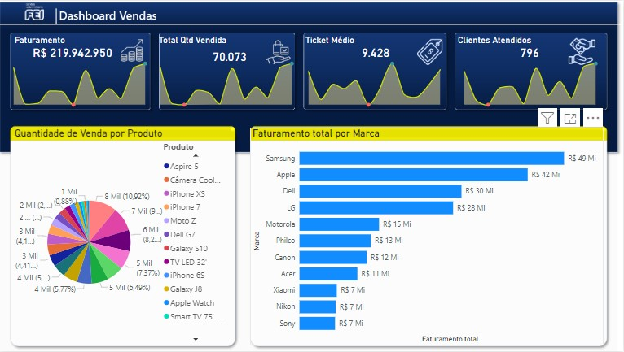

# Dashbord Relatorio Comercial
## 1. Problema de Negócio
O setor Comercial da empresa, com foco na venda de produtos e aquisição de clientes, solicitou relatório no formato de dashboard para acompanhamento de métricas que possam ajuda-los entender melhor o desempenho da equipe, auxiliando também na tomada de melhores decisões. 
- Algumas das métricas são: Faturamento, Total de Vendas, Produtos, Marca, Loja.

## 2. Estratégia da Solução
- Planejada uma análise descritiva como suficiente para atender ao problema de negócio.
- Foi desenvolvido um dashbord agrupando as métricas financeiras da base de dados fornecida pelo setor.

### 2.1 Imagem do Dashboard

## 3. Tecnologias usadas
- **Excel:** Recebimento da base de dados original;
- **Power BI:** Tratamento de dados, construção de tabelas métricas e dashboard.

## 4. Como executar o projeto
- Acesse o arquivo "Relatorio_Comercial.pbix";
- Utilize os filtros e gráfico interativos para visualização das métricas.

## 5. Top 3 Insights de dados
- A Samsung é a marca com maior participação no faturamento da emrpesa
  - Sugestão: Realizar uma **análise diganóstica** para entender o que faz a Samsung gerar o maior faturamento da empresa, isso pode ajudar a equipe Comercial a criar novas estratégias
- No período analisado, os mêses de junho e março tiveram os menores registros de faturamento, cliente atendidos, total de itens vendidos e ticket médio. Comportamento este que não se mostrou sazonal no período analisado
  - Sugestão: Realizar uma **análise diganóstica**, com outros dados e informações do time comercial e com um maior período histório, para entender o levou o mês de março e junho a terem estas marcas baixas e se este comportamento se mostra sazonal.
- O Galaxy S8 é o produto da empresa mque mais gerou faturamento no período analisado

## 6. Próximos Passos
1. Automatização do dashboard após novo recebimento de dados.
2. Realizar uma análise diagnóstica para estudo dos insights sugeridos no item 5 e outras solicitações da equipe de RH.